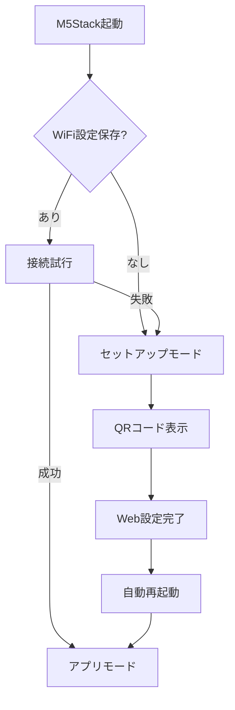
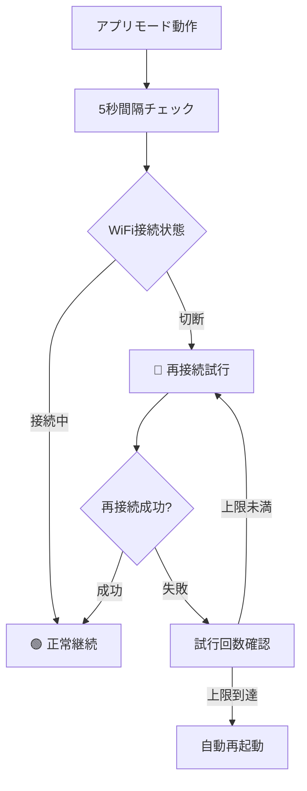

# M5Stack WiFi設定システム - プロ仕様IoTデバイス管理

🚀 **M5Stack用高機能WiFi設定システム** - 商用レベルの完成度

## ✨ 主要機能

### **🎯 3モード動作制御**
- **📋 セットアップモード**: QRコード付きWiFi初期設定
- **🖥️ アプリモード**: カスタマイズ可能なメインアプリ画面  
- **⚙️ 設定モード**: 詳細状況確認・管理機能

### **🌐 モダンWebUI**
- **Ajax対応**: ページリロード不要のネットワーク更新
- **レスポンシブデザイン**: スマホ・PC・タブレット対応
- **キャプティブポータル**: 自動設定画面転送
- **4カラーテーマ**: ブルー・グリーン・オレンジ・ピンク

### **📱 高機能タッチUI**
- **直感的操作**: タッチスクリーン + 物理ボタン対応
- **QRコード接続**: WiFi設定・Web画面への即時アクセス
- **リアルタイム監視**: 接続状態の視覚的フィードバック
- **日本語対応**: 美しい日本語フォント表示

### **🔄 自動WiFi管理**
- **定期監視**: 5秒間隔での接続状態チェック
- **自動再接続**: 切断検出時の復旧処理（最大10回）
- **障害時復旧**: 復旧不能時の自動再起動
- **状態可視化**: LED・画面での接続状況表示

## 🚀 クイックスタート

### **1. Arduino IDEセットアップ**
```bash
# M5WiFiConfig/M5WiFiConfig.ino をArduino IDEで開く
# 他のファイル（config.h, styles.h）も自動的に読み込まれます
```

### **2. 必要ライブラリ**
- **M5Unified** (最新版推奨) - M5Stack統合ライブラリ
- WiFi, WebServer, DNSServer, Preferences, ESPmDNS (ESP32標準)

### **3. ボード設定**
- **対象デバイス**: M5Stack-Core2（タッチスクリーン必須）
- **ボード設定**: ESP32 Arduino > M5Stack-Core2
- **通信ポート**: 適切なCOMポート選択

### **4. カスタマイズ（config.h）**
```cpp
// 基本設定
#define APP_TITLE "あなたのアプリ名"          // アプリケーション名
#define AP_SSID "Your-Device-Setup"          // セットアップ用AP名
#define AUTHOR_NAME "YourName"               // 作者名

// WiFi監視設定  
#define WIFI_CHECK_INTERVAL 5000             // 監視間隔（ミリ秒）
#define WIFI_RECONNECT_ATTEMPTS 10           // 再接続試行回数

// UI色設定
#define APP_COLOR M5.Display.color565(52, 200, 190)      // アプリ画面色
#define SETUP_COLOR M5.Display.color565(195, 87, 87)     // セットアップ画面色
```

### **5. デプロイ**
- **コンパイル**: ✓ボタンでエラーチェック
- **アップロード**: →ボタンでM5Stackへ書き込み

## 🎮 操作方法

### **タッチスクリーン操作（推奨）**

| 画面モード | 左タッチ | 中央タッチ | 右タッチ |
|-----------|---------|-----------|---------|
| **アプリ画面** | 設定画面へ | --- | --- |
| **設定画面** | アプリに戻る | 再起動 | 初期化 |
| **セットアップ** | --- | --- | --- |

### **物理ボタン操作**
- **BtnA**: 左タッチと同等
- **BtnB**: 中央タッチと同等  
- **BtnC**: 右タッチと同等

### **状態表示**
- **🔴/🟢 LED**: WiFi接続状態（赤=切断、緑=接続）
- **画面右上**: 点滅アイコンでリアルタイム状態表示
- **QRコード**: 各画面下部に配置（用途別）

## 🌐 WebUI機能

### **WiFi設定ページ**
- **🔄 ネットワーク更新**: Ajaxでリアルタイム更新
- **🔒 暗号化表示**: WPA/オープンの視覚的区別
- **📶 信号強度**: dBm数値で電波品質表示
- **📱 レスポンシブ**: あらゆるデバイスサイズに対応

### **管理ページ**
- **📊 詳細ステータス**: 接続時間・信号強度・IPアドレス
- **🔄 設定リセット**: 安全な初期化機能
- **📱 QRアクセス**: 管理画面への即時アクセス

## 🎨 カスタマイズ

### **Webテーマ切り替え**
`config.h`で4種類から選択：

```cpp
// テーマ1: ブルー・パープル（デフォルト）
#define THEME_PRIMARY_START "#667eea"

// テーマ2: グリーン・ティール  
#define THEME_PRIMARY_START "#10b981"   // コメントアウト解除

// テーマ3: オレンジ・レッド
#define THEME_PRIMARY_START "#f97316"   // コメントアウト解除

// テーマ4: ピンク・パープル
#define THEME_PRIMARY_START "#ec4899"   // コメントアウト解除
```

### **アプリ画面カスタマイズ**
`drawMainPage()`関数で自由に実装：

```cpp
void drawMainPage(){
    // センサーデータ表示例
    M5.Display.drawString("温度: 25.3℃", 10, 60);
    M5.Display.drawString("湿度: 60%", 10, 80);
    
    // グラフ・チャート表示
    // IoTダッシュボード実装
    // リアルタイムデータ可視化
}
```

## 🔧 動作フロー

### **初回起動**


### **WiFi監視**


## 🛠️ トラブルシューティング

### **コンパイル関連**
| 問題 | 原因 | 解決方法 |
|------|------|----------|
| **ライブラリエラー** | M5Unified未インストール | ライブラリマネージャーでインストール |
| **ボードエラー** | 間違ったボード選択 | M5Stack-Core2を選択 |
| **ポートエラー** | デバイス未認識 | USBケーブル・ドライバー確認 |

### **WiFi接続関連**  
| 問題 | 原因 | 解決方法 |
|------|------|----------|
| **接続失敗** | パスワード間違い | 正しいパスワード入力 |
| **5GHz接続** | 非対応周波数 | 2.4GHz WiFiを使用 |
| **弱電波** | 距離・障害物 | ルーター近くで再試行 |

### **WebUI関連**
| 問題 | 原因 | 解決方法 |
|------|------|----------|
| **ページ未表示** | IPアドレス不明 | QRコードまたは192.168.4.1 |
| **更新ボタン無反応** | ネットワークエラー | ブラウザ再読込み |
| **キャプティブポータル無効** | DNS設定 | 手動でIPアクセス |

## 📊 システム仕様

### **ハードウェア要件**
- **対応機種**: M5Stack Core2（タッチスクリーン必須）
- **必要メモリ**: 約200KB RAM、50KB Flash
- **WiFi**: 2.4GHz 802.11 b/g/n

### **ソフトウェア仕様**
- **開発環境**: Arduino IDE 1.8.x以降 / Arduino IDE 2.x
- **対応OS**: Windows, macOS, Linux
- **ライブラリ**: M5Unified, ESP32標準ライブラリ群

### **ネットワーク仕様**
- **アクセスポイント**: WPA2-PSK暗号化
- **Webサーバー**: HTTP/1.1, ポート80
- **DNS**: キャプティブポータル対応
- **mDNS**: device.local アクセス

## 📁 プロジェクト構成

```
M5Stack_WiFi_Modern/
├── M5WiFiConfig/              # Arduino IDEスケッチ
│   ├── M5WiFiConfig.ino      # メインプログラム
│   ├── config.h              # 設定定義
│   ├── styles.h              # WebUI生成
│   └── README_Arduino.md     # 詳細マニュアル
├── README.md                 # このファイル
├── LICENSE                   # MITライセンス
└── .gitignore               # Git設定
```

## 🔄 バージョン履歴

- **v2.0.0** - 3モード制御・Ajax更新・自動WiFi監視
- **v1.5.0** - M5Unified対応・タッチUI・QRコード
- **v1.0.0** - 初期リリース・基本WiFi設定機能

## 🎯 用途・応用例

### **IoTプロトタイプ**
- センサーデータ収集・表示
- リモート制御システム
- 環境モニタリング

### **商用製品ベース**
- そのまま製品組み込み可能
- 企業ブランディング対応
- 大量デプロイ対応

### **教育・学習**
- WiFi設定システムの学習
- WebUI開発の実例
- IoT開発のテンプレート

## 📄 ライセンス

MIT License - 商用・個人利用自由

## 🤝 コントリビューション

- **バグ報告**: GitHubのIssueで報告
- **機能提案**: プルリクエストまたはIssueで提案  
- **改良**: フォーク後にプルリクエスト

## 🏆 評価

**⭐⭐⭐⭐⭐ プロダクションレディ**

- ✅ **商用レベル**: そのまま製品利用可能
- ✅ **ユーザビリティ**: 直感的3モードUI
- ✅ **堅牢性**: 自動復旧・エラーハンドリング
- ✅ **拡張性**: 簡単カスタマイズ・モジュール化
- ✅ **保守性**: 詳細ログ・構造化コード

---

**🚀 M5Stack WiFi設定システムの決定版 - あらゆるIoTプロジェクトの強力な基盤 🚀**